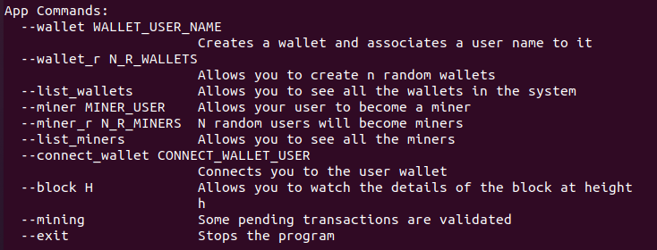
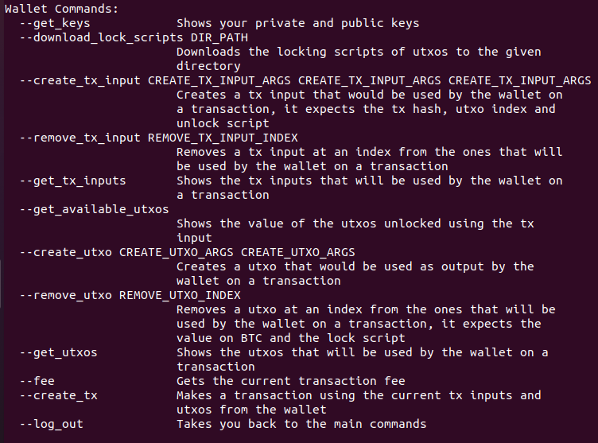
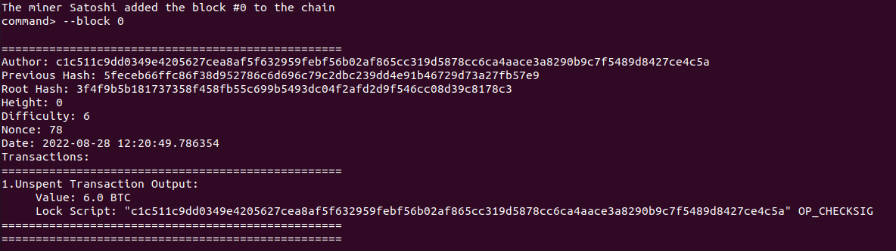
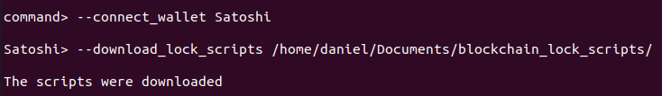
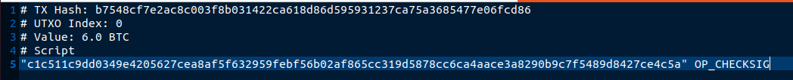
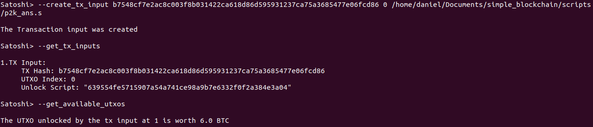
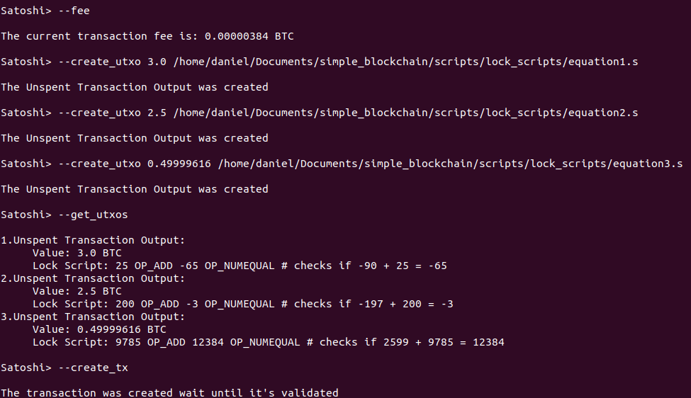
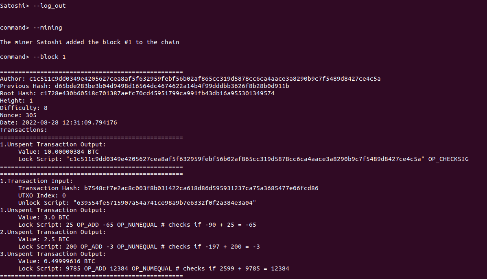

# Simple Blockchain

This program is a simple simulation of a blockchain which focuses on the creation of transactions.

For more information about bitcoin transactions visit: https://github.com/bitcoinbook/bitcoinbook/blob/develop/ch06.asciidoc

## Aplication Commands:

## Wallet Commands:

## Genesis Block:

Satoshi initializes the system by mining the genesis block.

### Notes:

Block Fields:

Author: is the public key of the user who mined the block.
Previous Hash: is the hash of the previous block, on this case is the hash of 0
Root Hash: is the root of a merkle tree which was created with the transactions
Height: is the height of the blockchain where the block can be found
Difficulty: is the number of binary zeroes used for the proof of work
Nonce: is the number that satifies the proof of work
Date: is a timestamp which indicates when the block was mined
Transactions: is a field with all the transactions that were validated

The first transaction is known as coin base a special transaction used to create btc and
collect transaction fees, the system has a virtual machine which is able to process btc
scripts, for the moment only addition, equality and signature checking are supported.

The virtual machine can only process signed integers of 64 bits.

OP_CHECKSIG does not validate signatures yet, it's enought to provide a unlock_script with
whatever input and it gets validated.

Each Miner uses the script P2K to lock the coin base transaction.

The private and publick key are different each time this system becomes a process.

## Example

download_lock_scripts gets the locking script of all the utxos that can be spent, be careful
with the path.

Each lock script gives you the hash of the trasanction that has the utxo and the index where
the utxo is found, it gives how much btc the utxo is worth and the script that has to be solved.

A normal transaction needs transaction inputs and unspent transaction outputs to be created,
so the user has to define which utxos are going to be spent using the tx inputs, the input needs the tx hash, the utxo index and the unlock script.

The system imposes a fee that users must pay for using it, the fee your transaction is paying is calculated as fee = total_value_inputs - total_value_outputs, so be careful of paying more fees than necessary.

Each utxo has a value and a lock script that needs to be solved if someone wants to spend the utxo.

Finally if the inputs and outputs are as you want them, then you can create the transaction.

