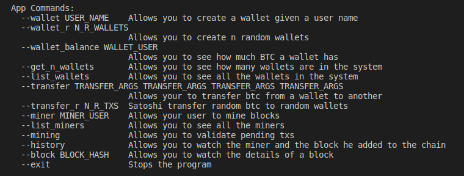

# Simple Blockchain

This program is a simple simulation of a blockchain, users can make trasactions or block mining, the next image contains wall the commands a user can use:

## Note:
--transfer has the next arguments From_User To_user Amount Fee
