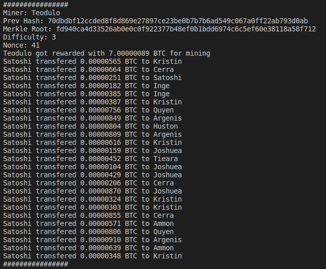

# Simple Blockchain

This program is a simple simulation of a blockchain, users can make trasactions or block mining, the next image contains all the commands a user can use:

## Commands:

## Structure of a block:

#### Observations:
The diffiulty is the number of 0's that the header's hash has.

## Note:

Run the program using **python3 app.py**

You can see the commands anytime using the command: --help

--transfer has the next arguments From_User To_user Amount Fee
