# Simple Blockchain

This program is a simple simulation of a blockchain, you can interact with it using console commands

## Commands:

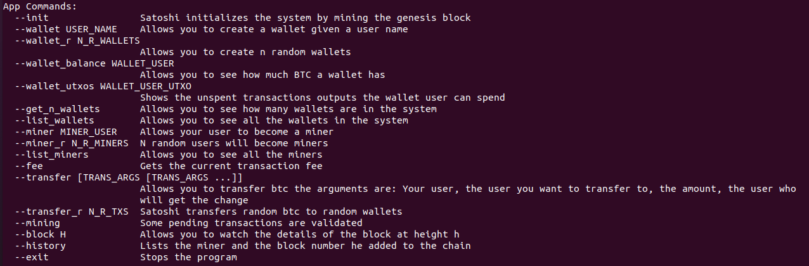

## System initialization

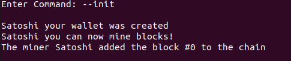

## Genesis Block:
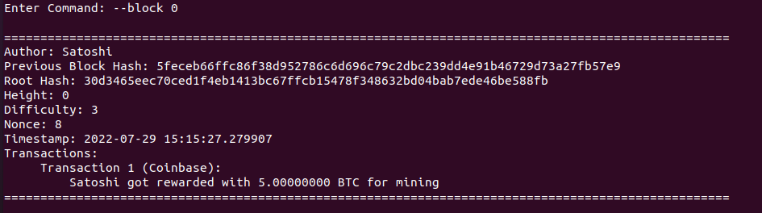

## Wallet creation

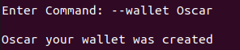

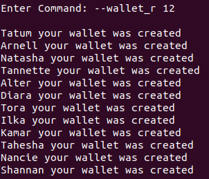

## Checking a wallet's balance

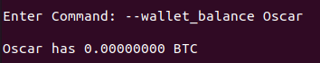

## Checking a wallet's utxos

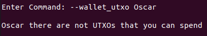

### Note:

If you want to know more about utxos visit: https://github.com/bitcoinbook/bitcoinbook/blob/develop/ch06.asciidoc

## Getting the number of wallets created

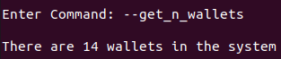

## Listing the wallets

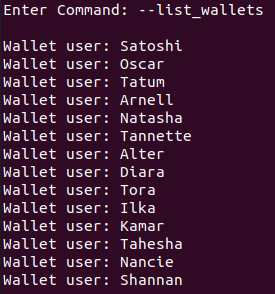

## Miner creation

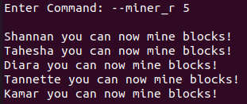

## Listing the miners

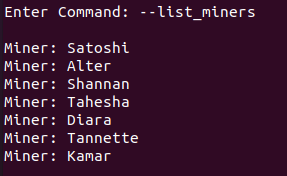

## Checking the transaction fee

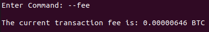

### Note:

The transaction fee changes everytime a block is added to the chain

## Transaction making

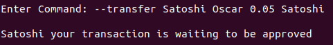

### Note:

The arguments are: the user name of the one making the transaction, the beneficiary, the amount of btc and a third user that will get the change of the transaction (it can be any user who has a wallet)

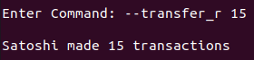

## Mining a block

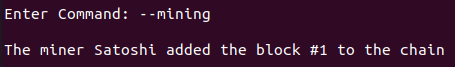

## Displaying a block's data

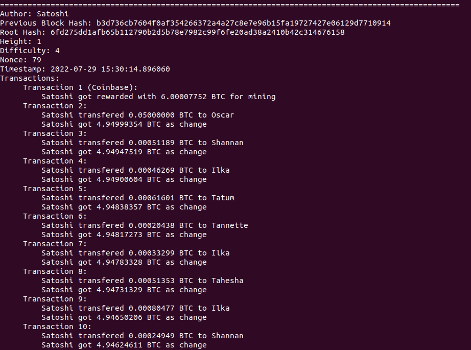

### Note:

The difficulty is the number of binary zeroes that must be found in a hash digest

## Getting the chain's history

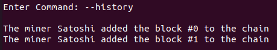

## Note:

Run the program using **python3 main.py**

You can see the commands anytime using the command: **--help**